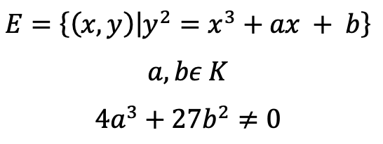

# Diffie-Hellman
Simple Diffie-Hellman client/server key exchange

The primary concept in this topic is Elliptic Curve. Elliptic Curve Cryptography or simply ECC makes us use shorter encryption keys and also use fewer memory and CPU resources. This comes with much lower number of bits used for encryption as we requires more sophisticated encryption.

Diffie-Hellman protocol is basically Elliptic Curve Discrete Log problem. In essence, there is a one way function using scalar multiplication.

The above eqation is one way, which means that it is easy to find Q but quite impossible to find k when we only have Q. 
